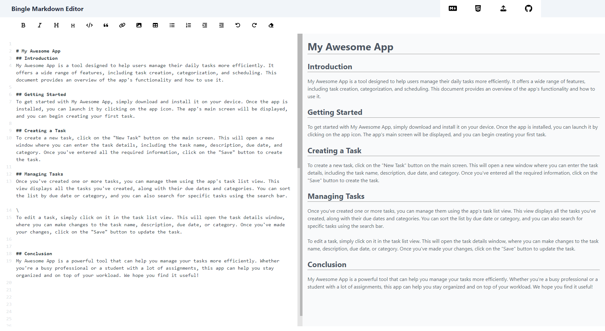
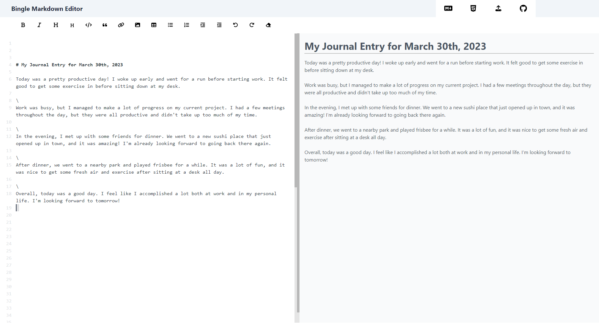

# Bingle Markdown Editor

Bingle is a web app that allows you to create and edit markdown files with ease. You can use it to write READMEs, blog posts, documentation, and more! The website can be found [here](lyubomirt.github.io/bingle-md/)

## Features

- Live preview of your markdown file
- Syntax highlighting
- Export your file as HTML or MD
- Auto-saving and backup
- Support for tables, code blocks, and other markdown elements

## Demo

## Installation

To run Markdown Editor on your local machine, follow these steps:

1. Clone this repository: `git clone https://github.com/LyubomirT/markdown-editor.git`
2. Simply run `index.html` in your browser

## Usage

To use this Markdown Editor, simply type or paste your markdown content in the left panel and see the rendered output in the right panel. You can also use the toolbar buttons to insert common markdown elements.

To save your file, click on the "HTML" or "Markdown" button, then it will be downloaded to your local machine. To open an existing file, click on the "Upload" button and select your file from your computer.

## Contributing

Markdown Editor is an open source project and contributions are welcome. If you want to contribute to this project, please follow these guidelines:

- Fork this repository and create a pull request for your feature or bug fix
- Write clear and descriptive commit messages and pull request titles
- Test your code before submitting your pull request

## License

Markdown Editor is licensed under the MIT License. See [LICENSE](LICENSE) for more details.

## Credits

Markdown Editor was created using , [CodeMirror](https://codemirror.net/), [Highlight.js](https://highlightjs.org/), [Font Awesome](https://fontawesome.com/) and [Markdown-it](https://github.com/markdown-it/markdown-it).

Fun fact: This readme was created using Bingle 😄